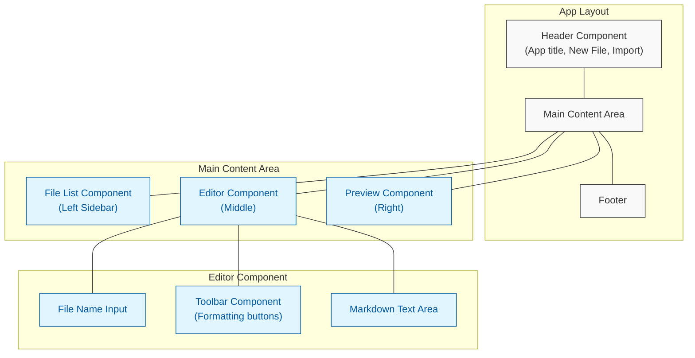
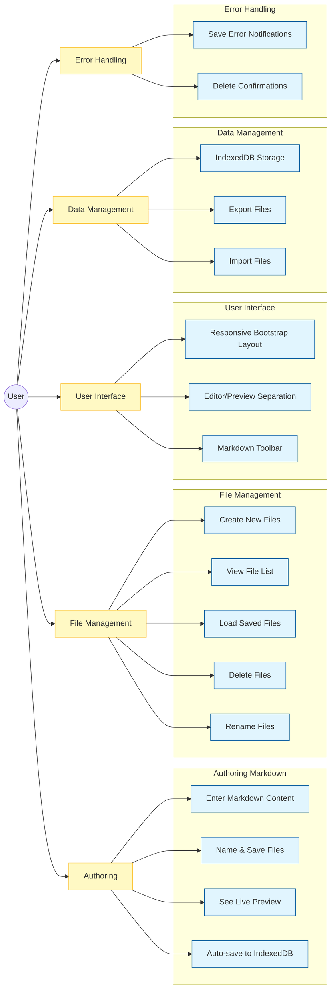
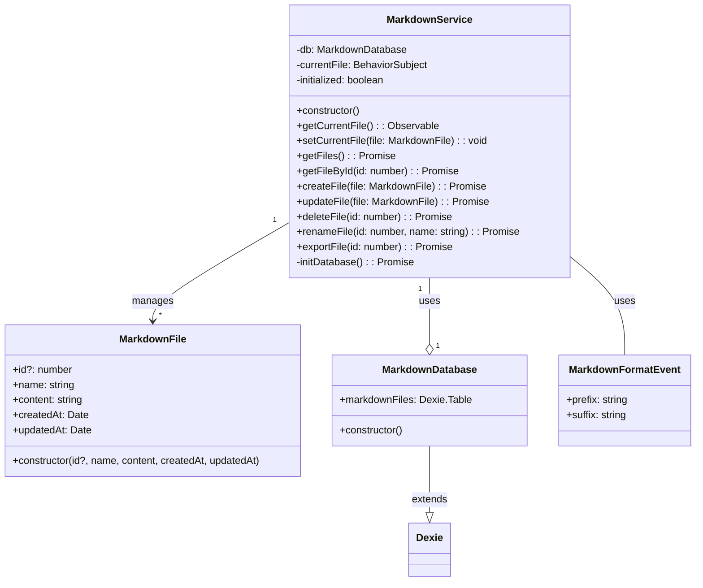
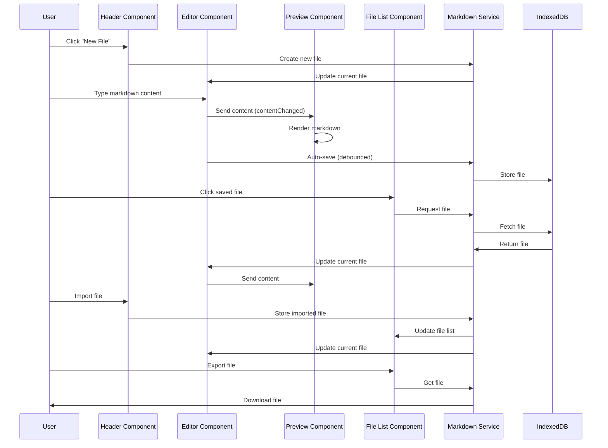

# ngMarkDown - Angular Markdown Editor

A responsive, feature-rich Markdown editor web application built with Angular and Bootstrap. This application allows users to create, edit, preview, save, and manage markdown files locally in the browser using IndexedDB.

## UI Layout



## Application Diagrams

### Component Architecture

```mermaid
graph TD
    A[App Component] --> B[Header Component]
    A --> C[File List Component]
    A --> D[Editor Component]
    A --> E[Preview Component]
    D --> F[Toolbar Component]
    
    G[MarkdownService] <--> C
    G <--> D
    B <--> G
    G <--> I[(IndexedDB)]
    
    D -- contentChanged --> E
    F -- format --> D
    B -- fileImported --> A
    
    J[MarkdownFile Model] <- G
    J <- C
    J <- D

    classDef service fill:#f9f,stroke:#333,stroke-width:2px
    classDef component fill:#bbf,stroke:#333,stroke-width:1px
    classDef model fill:#bfb,stroke:#333,stroke-width:1px
    classDef database fill:#fbb,stroke:#333,stroke-width:2px
    
    class A,B,C,D,E,F component
    class G service
    class J model
    class I database
```

### User Stories Diagram



## Application Design

### Architecture

The application follows a component-based architecture with a clear separation of concerns:

- **Models**: Define data structures using TypeScript classes
- **Services**: Handle data operations and business logic
- **Components**: Build UI and handle user interactions

### Component Structure

The application is divided into several key components:

- **Header Component**: Contains app title and actions for creating new files and importing markdown
- **File List Component**: Displays saved files with options to load, rename, export, and delete
- **Editor Component**: Provides a text area for writing markdown with auto-save functionality
- **Preview Component**: Shows real-time rendered markdown preview
- **Toolbar Component**: Offers formatting buttons for common markdown syntax

### Class-Based Design

The application uses TypeScript classes for strong typing and better code organization:



Example implementation:

```typescript
// Example of the MarkdownFile model class
export class MarkdownFile {
  constructor(
    public id?: number,
    public name: string = 'Untitled',
    public content: string = '',
    public createdAt: Date = new Date(),
    public updatedAt: Date = new Date()
  ) {}
}

// Database class using Dexie.js
export class MarkdownDatabase extends Dexie {
  markdownFiles!: Dexie.Table<MarkdownFile, number>;

  constructor() {
    super('MarkdownDatabase');
    this.version(1).stores({
      markdownFiles: '++id, name, content, createdAt, updatedAt'
    });
  }
}
```

### Key Features

1. **Real-time Markdown Preview**: See rendered markdown as you type
2. **Local Storage with IndexedDB**: Files are saved automatically using Dexie.js
3. **Responsive Design**: Bootstrap-based UI works on desktop and mobile devices
4. **File Management**: Create, rename, delete, import, and export markdown files
5. **Markdown Toolbar**: Quickly insert common markdown syntax elements
6. **Auto-Save**: Content is saved automatically during editing

### Technologies Used

- **Angular 14**: Front-end framework
- **Bootstrap 5**: UI framework for responsive design 
- **Marked.js**: Markdown to HTML parser
- **Dexie.js**: IndexedDB wrapper for browser storage
- **Bootstrap Icons**: For UI icons

### Data Flow Diagram

The following sequence diagram illustrates the key user interactions and the resulting data flow between components:



This diagram shows the key interactions and data flow paths:
1. Creating a new file
2. Editing and auto-saving markdown content
3. Real-time preview updating
4. Loading saved files
5. Importing and exporting files

## Development

### Development server

Run `ng serve` for a dev server. Navigate to `http://localhost:4200/`. The application will automatically reload if you change any of the source files.

### Build

Run `ng build` to build the project. The build artifacts will be stored in the `dist/` directory.

### Running unit tests

Run `ng test` to execute the unit tests via [Karma](https://karma-runner.github.io).

## Further help

To get more help on the Angular CLI use `ng help` or go check out the [Angular CLI Overview and Command Reference](https://angular.io/cli) page.
